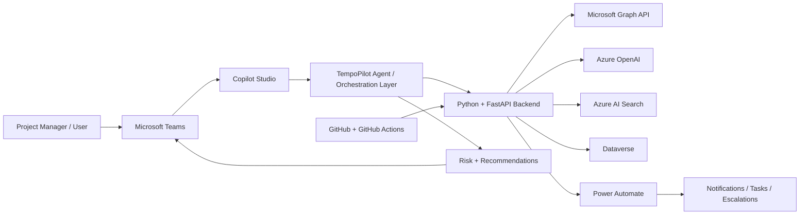

# TempoPilot Architecture

## High-level system view

## Responsibility by layer

### 1. Teams
Teams is the user-facing surface where the experience is delivered.

Responsibilities:
- display project risk summaries
- surface recommended actions
- provide notifications and quick follow-ups
- support the user workflow for project coordination

### 2. Copilot Studio
Copilot Studio is the orchestration layer for the conversational experience.

Responsibilities:
- manage user intents and prompts
- handle natural language interactions
- call the backend API for project risk analysis
- present results or next-step actions in Teams

### 3. Python + FastAPI backend
This repository contains the backend intelligence layer.

Responsibilities:
- authenticate with Microsoft Graph
- collect project signals
- normalize raw activity into a consistent signal model
- calculate risk using explainable rules
- call Azure OpenAI for root-cause summaries
- expose the API to the Teams agent or other consumers

### 4. Microsoft Graph API
Graph is the system input layer for collaboration and project activity.

Responsibilities:
- read calendar events
- read messages and engagement signals
- read tasks and approvals
- provide project health data from Microsoft 365

### 5. Azure OpenAI
Azure OpenAI adds reasoning and natural language explanations.

Responsibilities:
- explain why a risk was detected
- summarize project conditions and evidence
- suggest next actions
- turn raw signals into human-readable reasons

### 6. Azure AI Search
Azure AI Search provides future retrieval and evidence lookup.

Responsibilities:
- index project and activity context
- retrieve relevant evidence for AI reasoning
- support explainability and context grounding

### 7. Dataverse
Dataverse is the structured storage layer for project and risk data.

Responsibilities:
- store project metadata
- store risk records and snapshots
- persist recommendations and action history
- support reporting and analysis across time

### 8. Power Automate
Power Automate handles workflow execution.

Responsibilities:
- trigger email or Teams notifications
- create follow-up tasks
- escalate issues when thresholds are crossed
- connect the backend risk signal to operational action

### 9. GitHub + GitHub Actions
GitHub and GitHub Actions provide development workflow and automation.

Responsibilities:
- source control
- CI/CD validation
- dependency and environment automation
- deployment workflows

---

## Current implementation focus

The current repository is focused on the backend intelligence layer:

- Graph signal collection
- signal normalization
- risk scoring logic
- AI explanation integration
- API flow for project risk analysis

This is the foundation for the larger end-to-end architecture.

---

## Recommended future expansion

The next major layers to add after the backend foundation are:

1. Dataverse persistence for project risk records
2. Copilot Studio orchestration and agent flow
3. Power Automate actions for follow-ups and escalations
4. deeper Graph signal coverage for approvals, tasks, and stakeholder engagement
